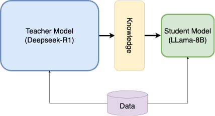
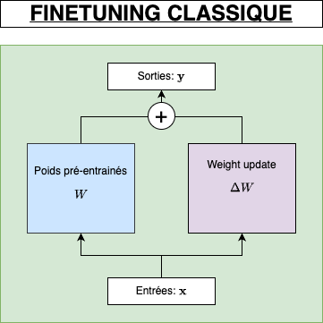
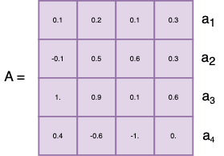
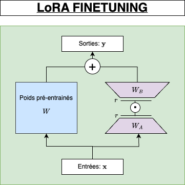

## Introduction   

The goal of this project is to fine-tune the DeepSeek Distilled Llama R1 model using 4-bit quantization provided by Unsloth. This will also give us the opportunity to thoroughly revisit key concepts such as LoRA, QLoRA, and quantization. For training and model serving, we will leverage AWS services to ensure scalability and efficiency.

## A bit of background
### 1. Deepseek-R1

DeepSeek-R1 was developed by the Chinese AI startup DeepSeek to enhance performance in complex reasoning tasks, including mathematics, coding, and logical inference. The model's training involved a multi-stage process:

TO_CHECK
- Supervised Fine-Tuning (SFT): Initially, the model was fine-tuned on a "cold-start" dataset comprising thousands of examples formatted to improve output readability and coherence.
- Reinforcement Learning (RL): Following SFT, the model underwent reinforcement learning using rule-based rewards to further enhance its reasoning capabilities.

/TO_CHECK

This training methodology enabled DeepSeek-R1 to achieve performance comparable to OpenAI's o1 model across various benchmarks. Notably, DeepSeek-R1 is open-source under the MIT License, allowing for widespread use and adaptation.

It is important to note that the objective of R1 was to enhance the reasoning capabilities of their previous models.

### 2. Distilled Models

Distilled models are compressed versions of larger machine learning models, created through a process called knowledge distillation. This technique involves training a smaller model (the student model) to mimic the performance of a larger, more complex model (the teacher model) while maintaining high accuracy and efficiency.

In our case, we will use the `deepseek-ai/DeepSeek-R1-Distill-Llama-8B` model. **Llama-8B** is one of Meta's smaller models, which has been further distilled to replicate the performance of the original **DeepSeek-R1** model. This distilled version retains much of the original model’s capabilities while being more efficient in terms of computational resources and memory usage.

## LoRA: Low-Rank Adaptation

Low-Rank Adaptation (LoRA) is a technique in machine learning designed to efficiently fine-tune large models for specific tasks without the need to retrain the entire model. This approach is particularly beneficial when working with large language models (LLMs) that have billions of parameters, as it significantly reduces computational costs and training time.

Traditional fine-tuning methods involve adjusting all parameters of a pre-trained model, which can be resource-intensive. LoRA addresses this by introducing low-rank matrices into the model's architecture. These matrices are smaller and require fewer parameters to train, allowing for efficient adaptation to new tasks. The original model's parameters remain unchanged, and the low-rank matrices are added to the existing weights during inference, enabling the model to perform specific tasks effectively.

If we have a look at regular finetuning:

The weight update is obtained during regular backpropagation and is typically calculated this way:

$$\Delta W = \alpha \left(- \nabla L_W \right)$$

Where $$\alpha$$ is the learning rate and $$\nabla L_W$$ is the gradient of the loss with respect to $$W$$.

When training fully connected (dense) layers in neural networks, weight matrices typically have full rank, meaning no redundant rows or columns.
In contrast, low rank means the matrix has redundant components.
For example, let be a matrix $$A \in \mathbf{R}^{4 \times 4}$$ :

Here we can see that $$a_1 = a_2 + \frac{1}{2}a_4$$. It means that $$A$$ is not full rank and that information is stored redundantly. So we could drop one of these rows and so reduce the dimensionality of $$A$$.

While pretrained model weights have full rank for their original tasks, the LoRA authors note that large language models exhibit a low "intrinsic dimension" when adapted
 to new tasks (Aghajanyan et al., 2020). This means the data can be approximated by a lower-dimensional space, allowing the new weight matrix to be decomposed into smaller
 matrices without significant loss of information.

So now our weight update is $$\Delta W = W_AW_B$$ with $$W \in \mathbf{R}^{m \times p}$$, $$W_A \in \mathbf{R}^{m \times r}$$ and $$W_B \in \mathbf{R}^{r \times p}$$; $$r$$ being the new rank.
Typically, $$r$$ is predetermined before training and remains fixed, while the decomposition is learned during training.

## QLoRA
QLoRA is an efficient finetuning method that enables training a 65B parameter model on a single 48GB GPU while retaining full 16-bit performance. It works by backpropagating gradients through a frozen, 4-bit quantized pretrained language model into Low Rank Adapters (LoRA). Key innovations include:

 1. 4-bit NormalFloat (NF4): An optimal data type for normally distributed weights.
 2. Double Quantization: Reduces memory footprint by quantizing the quantization constants.
 3. Paged Optimizers: Effectively manage memory spikes during training.

### Block-wise k-bit Quantization

To understand the basics of quantization, I recommend this comprehensive article: [https://newsletter.maartengrootendorst.com/p/a-visual-guide-to-quantization](https://newsletter.maartengrootendorst.com/p/a-visual-guide-to-quantization).

Quantization is the process of discretizing an input from a representation that holds more information to a representation with less information. It often means
taking a data type with more bits and converting it to fewer bits, for example from 32-bit floats to 8-bit Integers. To ensure that the entire range of the low-bit data type is used, the input data type is
commonly rescaled into the target data type range through normalization by the absolute maximum of the input elements, which are usually structured as a tensor. For example, quantizing a 32-bit
Floating Point (FP32) tensor into a Int8 tensor with range $$[−127, 127]$$:

$$\mathbf{X}^{\text{Int8}} = \text{round}(\frac{127}{\text{absmax}(\mathbf{X}^{\text{FP32}})}\mathbf{X}^{\text{FP32}}) = \text{round}(c^{\text{FP32}}\cdot\mathbf{X}^{\text{FP32}})$$

where $$c$$ is the quantization constant.

Dequantizaton is the inverse:

$$\text{dequant}(c^{\text{FP32}}, \mathbf{X}^{\text{Int8}}) = \frac{\mathbf{X}^{\text{Int8}}}{c^{\text{FP32}}} = \mathbf{X}^{FP32}$$

The problem with this approach is that if a large magnitude value (i.e., an outlier) occurs in the input
tensor, then the quantization bins—certain bit combinations—are not utilized well with few or no
numbers quantized in some bins. When quantizing data, we just saw that we scale the entire tensor based on its largest absolute value. If that maximum is an outlier—a value much larger than the rest—it stretches the scale so that most of the other numbers fall into a very narrow range. This means that when the range is divided into bins (each representing a unique bit combination), many of those bins won't get any values because almost all the data is clustered in a few bins near zero. In essence, the outlier skews the distribution, leading to under-utilization of the available quantization levels and resulting in a loss of effective precision for the majority of the data.
To prevent the outlier issue, a common approach is to chunk the
input tensor into blocks that are independently quantized, each with their own quantization constant $$c$$.
This can be formalized as follows: We chunk the input tensor $$\mathbf{X} \in \mathbb{R}^{b\times h}$$ into $$n$$ contiguous blocks of
size $$B$$ by flattening the input tensor and slicing the linear segment into $$n = \frac{(b\times h)}{B}$$ blocks. We
quantize these blocks independently to create a quantized tensor and $$n$$ quantization
constants $$c_i$$.

### 4-bit NormalFLoat

The NormalFloat (NF) data type is built on Quantile Quantization. Unlike standard quantization (e.g., uniformly splitting a range into equal intervals), quantile quantization divides the data such that each bin receives approximately the same number of data points. This is achieved by using the empirical cumulative distribution function (CDF) of the tensor. Essentially, you determine the quantiles (or percentiles) of the data, and these quantiles then define the bin boundaries. This approach ensures that each bin is "evenly" populated, which is why it’s considered information-theoretically optimal—each bin carries roughly the same amount of information.

Since large pretrained neural network weights usually have a zero-centered normal distribution with
standard deviation $$\sigma$$, we can transform all weights to a single fixed distribution by
scaling $$\sigma$$ such that the distribution fits exactly into the range of our data type. For our data type, we
set the arbitrary range $$[−1, 1]$$. As such, both the quantiles for the data type and the neural network
weights need to be normalized into this range.

The information theoretically optimal data type for zero-mean normal distributions with arbitrary
standard deviations $$\sigma$$ in the range $$[−1, 1]$$ is computed as follows:
1. estimate the $$2k + 1$$ quantiles of a theoretical $$N (0, 1)$$ distribution to obtain a $$k$$-bit quantile quantization data type for normal distributions
2. take this data type and normalize its values into the $$[−1, 1]$$ range
3. quantize an input weight tensor by normalizing it into the $$[−1, 1]$$ range through absolute maximum rescaling.

### Double Quantization
We have seen that, to minimize information loss during quantization, it is optimal to use several quantization constants that better capture the range and distribution of the original data. However, these additional constants themselves require substantial memory. To address this issue, the principle of double quantization is introduced. Double quantization means that the quantization constants are quantized as well—essentially applying a second layer of quantization to compress these constants. This approach reduces the overall memory footprint while maintaining the fidelity of the quantization process, making it more suitable for memory-constrained environments.

### Paged Optimizers
QLoRA is based on the NVIDIA unified memory feature that acts similarly to how an operating system handles memory paging between RAM and disk. When a GPU runs low on memory, this feature automatically transfers memory pages—sections of data—from the GPU to the CPU’s RAM, and then brings them back when they’re needed for operations like updating the optimizer. This automatic page-to-page transfer ensures that the GPU can continue processing without encountering out-of-memory errors, as it temporarily offloads less-critical data (in this case, the optimizer states) to the CPU. Essentially, it allows the system to handle memory shortages gracefully by dynamically managing where data is stored, much like traditional memory paging helps manage limited RAM by using disk space.

## Metrics

## Training

## Evaluation

## References

<link rel="icon" type="image/png" href="../../assets/img/favicons/favicon-96x96.png" sizes="96x96" />
<link rel="icon" type="image/svg+xml" href="../../assets/img/favicons/favicon.svg" />
<link rel="shortcut icon" href="../../assets/img/favicons/favicon.ico" />
<link rel="apple-touch-icon" sizes="180x180" href="../../assets/img/favicons/apple-touch-icon.png" />

