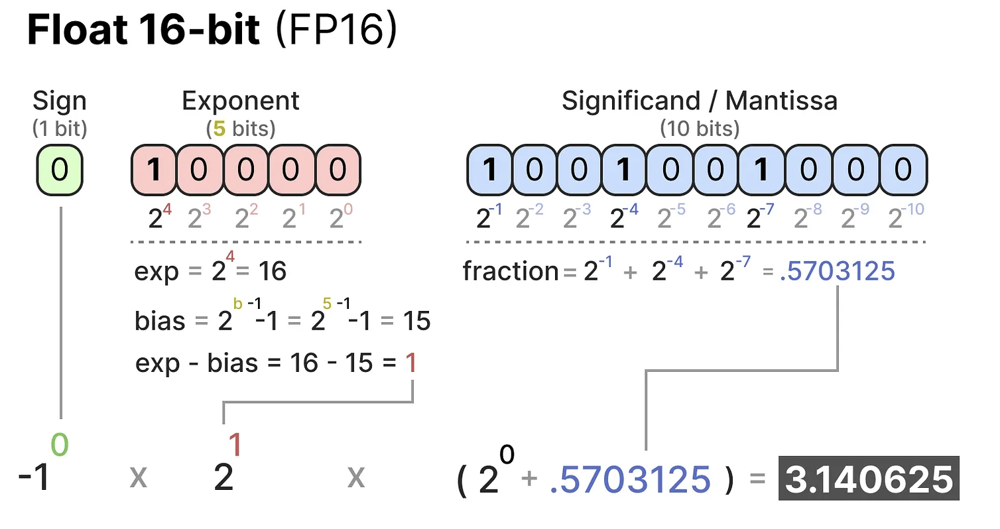
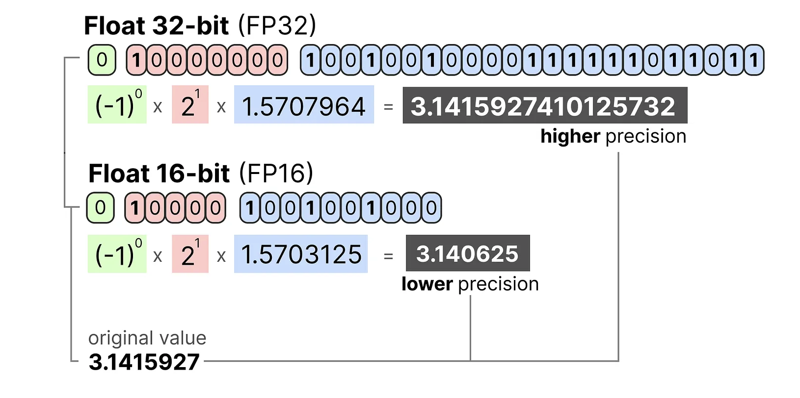
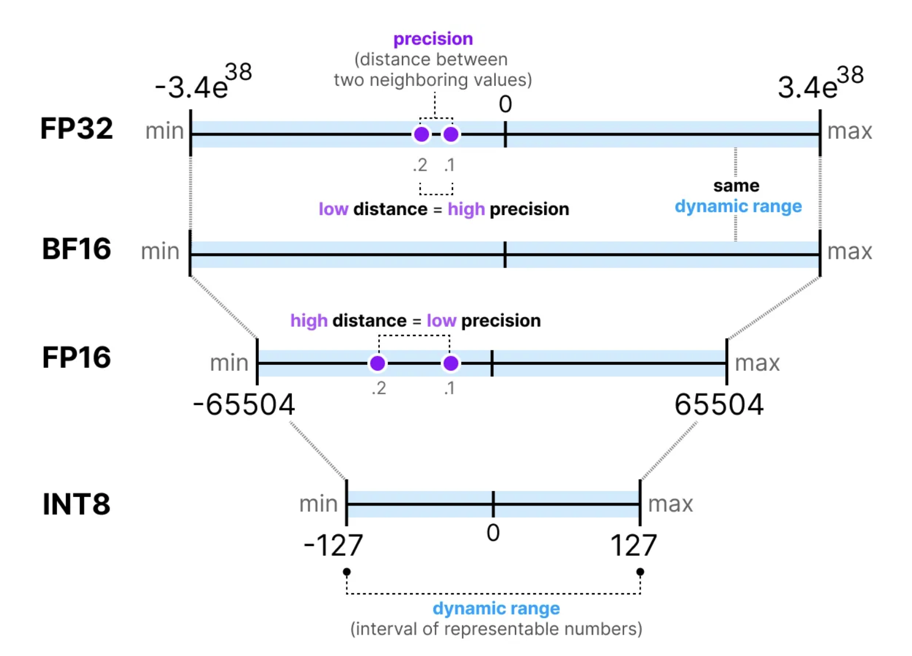
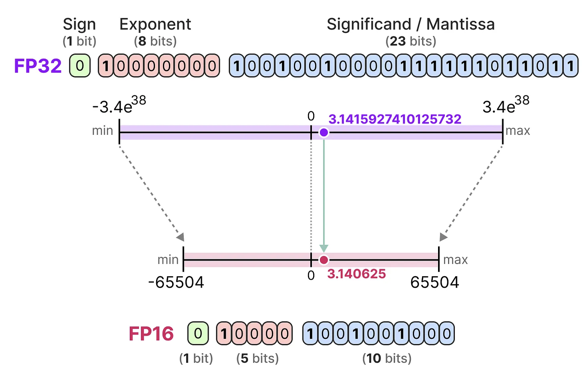
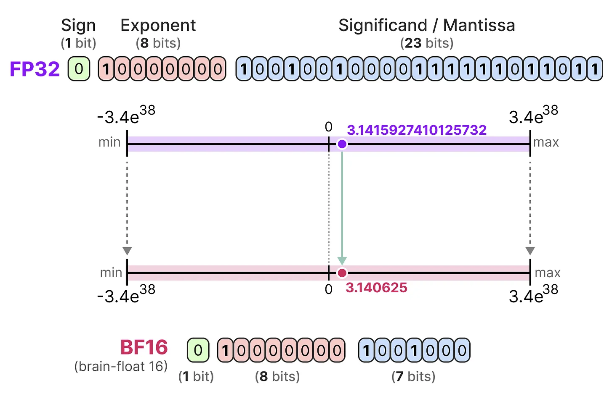
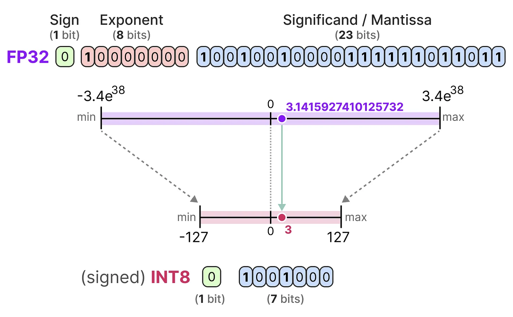
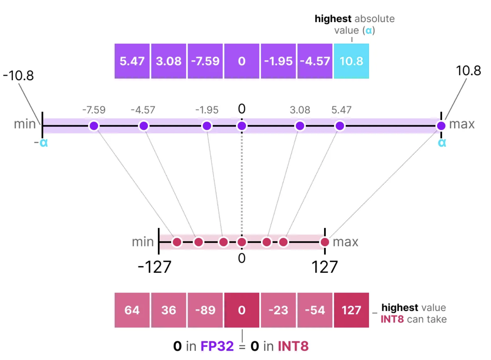
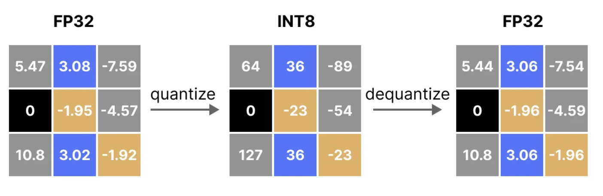

## Introduction   

The goal of this project is to fine-tune the DeepSeek Distilled Llama R1 model using 4-bit quantization provided by Unsloth. This will also give us the opportunity to thoroughly revisit key concepts such as LoRA, QLoRA, and quantization. For training and model serving, we will leverage AWS services to ensure scalability and efficiency.

## A bit of background
### 1. Deepseek-R1

DeepSeek-R1 was developed by the Chinese AI startup DeepSeek to enhance performance in complex reasoning tasks, including mathematics, coding, and logical inference. The model's training involved a multi-stage process:

TO_CHECK
- Supervised Fine-Tuning (SFT): Initially, the model was fine-tuned on a "cold-start" dataset comprising thousands of examples formatted to improve output readability and coherence.
- Reinforcement Learning (RL): Following SFT, the model underwent reinforcement learning using rule-based rewards to further enhance its reasoning capabilities.

/TO_CHECK

This training methodology enabled DeepSeek-R1 to achieve performance comparable to OpenAI's o1 model across various benchmarks. Notably, DeepSeek-R1 is open-source under the MIT License, allowing for widespread use and adaptation.

It is important to note that the objective of R1 was to enhance the reasoning capabilities of their previous models.

### 2. Distilled Models

Distilled models are compressed versions of larger machine learning models, created through a process called knowledge distillation. This technique involves training a smaller model (the student model) to mimic the performance of a larger, more complex model (the teacher model) while maintaining high accuracy and efficiency.

In our case, we will use the `deepseek-ai/DeepSeek-R1-Distill-Llama-8B` model. **Llama-8B** is one of Meta's smaller models, which has been further distilled to replicate the performance of the original **DeepSeek-R1** model. This distilled version retains much of the original model’s capabilities while being more efficient in terms of computational resources and memory usage.

## LoRA: Low-Rank Adaptation

Low-Rank Adaptation (LoRA) is a technique in machine learning designed to efficiently fine-tune large models for specific tasks without the need to retrain the entire model. This approach is particularly beneficial when working with large language models (LLMs) that have billions of parameters, as it significantly reduces computational costs and training time.

Traditional fine-tuning methods involve adjusting all parameters of a pre-trained model, which can be resource-intensive. LoRA addresses this by introducing low-rank matrices into the model's architecture. These matrices are smaller and require fewer parameters to train, allowing for efficient adaptation to new tasks. The original model's parameters remain unchanged, and the low-rank matrices are added to the existing weights during inference, enabling the model to perform specific tasks effectively.

If we have a look at regular finetuning:

The weight update is obtained during regular backpropagation and is typically calculated this way:

$$\Delta W = \alpha \left(- \nabla L_W \right)$$

Where $$\alpha$$ is the learning rate and $$\nabla L_W$$ is the gradient of the loss with respect to $$W$$.

When training fully connected (dense) layers in neural networks, weight matrices typically have full rank, meaning no redundant rows or columns.
In contrast, low rank means the matrix has redundant components.
For example, let be a matrix $$A \in \mathbf{R}^{4 \times 4}$$ :

Here we can see that $$a_1 = a_2 + \frac{1}{2}a_4$$. It means that $$A$$ is not full rank and that information is stored redundantly. So we could drop one of these rows and so reduce the dimensionality of $$A$$.

While pretrained model weights have full rank for their original tasks, the LoRA authors note that large language models exhibit a low "intrinsic dimension" when adapted
 to new tasks (Aghajanyan et al., 2020). This means the data can be approximated by a lower-dimensional space, allowing the new weight matrix to be decomposed into smaller
 matrices without significant loss of information.

So now our weight update is $$\Delta W = W_AW_B$$ with $$W \in \mathbf{R}^{m \times p}$$, $$W_A \in \mathbf{R}^{m \times r}$$ and $$W_B \in \mathbf{R}^{r \times p}$$; $$r$$ being the new rank.
Typically, $$r$$ is predetermined before training and remains fixed, while the decomposition is learned during training.

## Quantization

The more bits we use to represent a value, the more precise it generally is:

The more bits we have available, the larger the range of values that can be represented.
The interval of representable numbers a given representation can take is called the dynamic range whereas the distance between two neighboring values is called precision:

Since there are 8 bits in a byte of memory, we can compute how much memory a device needs to store a given value:

$$memory=\frac{n_{bits}}{8}\times n_{params}$$

So as we want, in our case, to finetune Llama-8B in FP-16 we need $$\frac{16}{8}\times8 \simeq 16 \text{ GB}$$ or $$\frac{32}{8}\times8 \simeq 32 \text{ GB}$$ to load the model. In practice, more things relate to the amount of (V)RAM you need during inference, like the context size and architecture.

Therefore, minimizing the number of bits used to represent your model's parameters, both during storage and training, is highly desirable. However, reducing precision often leads to a decline in model accuracy.

The goal is to lower the bit representation while preserving accuracy. This is where quantization plays a crucial role!

### Common Data Types
The main goal of quantization is to reduce the number of bits  needed to represent the original parameters while preserving the precision of the original parameters as best as possible.

For each reduction in bits, a mapping is performed to “squeeze” the initial FP32 representations into lower bits.

In practice, we do not need to map the entire FP32 range $$[-3.4\times 10^{38}, 3.4\times10^{38}]$$ into INT8. We merely need to find a way to map the range of our data (the model’s parameters) into INT8.

Common squeezing/mapping methods are symmetric and asymmetric quantization and are forms of linear mapping.

Let’s explore these methods to quantize from FP32 to INT8.

### Symmetric Quantization

In symmetric quantization, the range of the original floating-point values is mapped to a symmetric range around zero in the quantized space. In the previous examples, notice how the ranges before and after quantization remain centered around zero.

A nice example of a form of symmetric quantization is called absolute maximum ($$absmax$$) quantization.

Given a list of values, we take the highest absolute value $$\alpha$$ as the range to perform the linear mapping.

So in this case, to quantize an input $$\mathbb{x}$$, we compute:

$$\mathbb{x}_{quantized} = \text{ round}(s \cdot \mathbb{x})$$

where $$s$$ is the scaling factor such as $$s = \frac{2^{b-1}-1}{alpha}$$. $$b$$ is the number of bytes that we want to quantize to and $$\alpha$$ is the highest absolute value.

To retrieve the original FP32 values, we can use the previously calculated scaling factor $$s$$ to dequantize the quantized values:

$$\mathbb{x}_{dequantized} = \frac{\mathbb{x}_{quantized}}{s}$$

Applying the quantization and then dequantization process to retrieve the original looks as follows:

You can see certain values, such as $$3.08$$ and $$3.02$$ being assigned to the INT8, namely $$36$$. When you dequantize the values to return to FP32, they lose some precision and are not distinguishable anymore. 

## Metrics

## Training

## Evaluation

## References

<link rel="icon" type="image/png" href="../../assets/img/favicons/favicon-96x96.png" sizes="96x96" />
<link rel="icon" type="image/svg+xml" href="../../assets/img/favicons/favicon.svg" />
<link rel="shortcut icon" href="../../assets/img/favicons/favicon.ico" />
<link rel="apple-touch-icon" sizes="180x180" href="../../assets/img/favicons/apple-touch-icon.png" />

